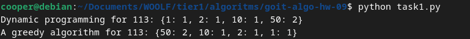

### Завдання 1 ([task1.py](task1.py))

Вам необхідно написати дві функції для касової системи, яка видає решту покупцеві:

 - Функція жадібного алгоритму <b>find_coins_greedy</b>. Ця функція повинна приймати суму, яку потрібно видати покупцеві, і повертати словник із кількістю монет кожного номіналу, що використовуються для формування цієї суми. Наприклад, для суми 113 це буде словник {50: 2, 10: 1, 2: 1, 1: 1}. Алгоритм повинен бути жадібним, тобто спочатку вибирати найбільш доступні номінали монет.
 - Функція динамічного програмування <b>find_min_coins</b>. Ця функція також повинна приймати суму для видачі решти, але використовувати метод динамічного програмування, щоб знайти мінімальну кількість монет, необхідних для формування цієї суми. Функція повинна повертати словник із номіналами монет та їх кількістю для досягнення заданої суми найефективнішим способом. Наприклад, для суми 113 це буде словник {1: 1, 2: 1, 10: 1, 50: 2}

Порівняйте ефективність жадібного алгоритму та алгоритму динамічного програмування, базуючись на часі їх виконання або О великому та звертаючи увагу на їхню продуктивність при великих сумах. Висвітліть, як вони справляються з великими сумами та чому один алгоритм може бути більш ефективним за інший у певних ситуаціях. 

Свої висновки додайте у файл readme.md домашнього завдання.

### Розвязок

<b>find_coins_greedy</b> Жадібний алгоритм (greedy algorithm) використовує стратегію вибору найбільшого можливого номіналу на кожному кроці, щоб мінімізувати кількість монет. Він працює дуже швидко, але не завжди гарантує оптимальне рішення для всіх наборів монет. Алгоритм ітерується по списку номіналів монет (починаючи з найбільшого) і вибирає максимальну кількість монет кожного номіналу, доки сума не буде зведена до 0.

<b>find_min_coins</b> метод динамічного програмування гарантує мінімальну кількість монет для досягнення суми. Він запам'ятовує результати для менших значень, щоб уникнути повторного обчислення для кожної суми. Алгоритм будує таблицю dp, де dp[i] зберігає мінімальну кількість монет для суми i. За допомогою цієї таблиці ми визначаємо мінімальну кількість монет для будь-якої суми від 1 до amount. Таблиця used_coins допомагає відстежити, які монети використовувались для досягнення мінімальної кількості.

#### Порівняння ефективності

<b>Жадібний алгоритм:</b>
Часова складність: O(n), де n — кількість різних номіналів монет. Жадібний алгоритм обчислює рішення за один прохід через список монет.
 - плюси: Простота і швидкість. Для наборів монет, де кожен більший номінал є кратним попереднього (як у випадку [50, 25, 10, 5, 2, 1]), цей підхід завжди дає оптимальне рішення.
 - мінуси: Для загальніших наборів монет (наприклад, [1, 3, 4]) жадібний алгоритм може не давати оптимальних рішень. Наприклад, для суми 6 з монетами [1, 3, 4], жадібний алгоритм вибере монету 4 та дві монети по 1, що не є мінімальною кількістю (1 монета 3 та 1 монета 3 дають краще рішення).

<b>Динамічне програмування:</b>
Часова складність: O(n⋅m), де n — кількість номіналів монет, а m — сума, яку потрібно видати. Це значно повільніше, ніж жадібний алгоритм, оскільки для кожної можливої суми алгоритм перевіряє всі номінали монет.
 - плюси: Гарантує мінімальну кількість монет для будь-якого набору номіналів монет.
 - мінуси: Повільніший для великих сум порівняно з жадібним алгоритмом.

<b>Висновок:</b>
Жадібний алгоритм є дуже швидким і ефективним для стандартних наборів монет, таких як [50, 25, 10, 5, 2, 1], оскільки він завжди дає оптимальне рішення в таких випадках. Динамічне програмування є більш загальним підходом, який забезпечує мінімальну кількість монет для будь-яких наборів монет, але цей метод є складнішим та може бути повільнішим для великих сум. Таким чином, жадібний алгоритм краще використовувати для випадків із добре структурованими номіналами монет, тоді як метод динамічного програмування слід використовувати для загальніших або нестандартних випадків, де важливо знайти мінімальну кількість монет.

